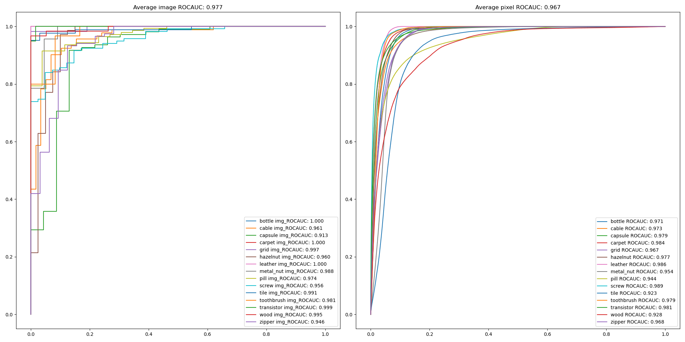
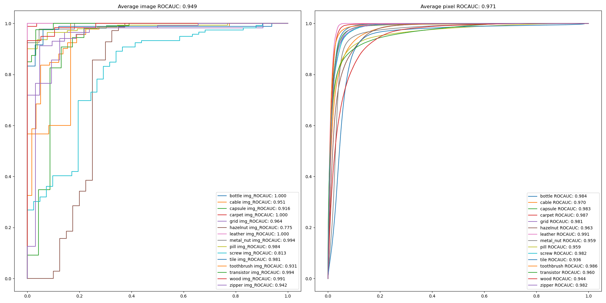
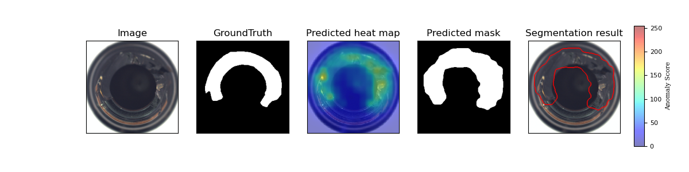
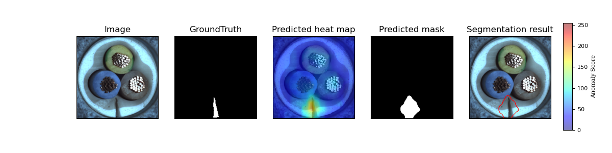
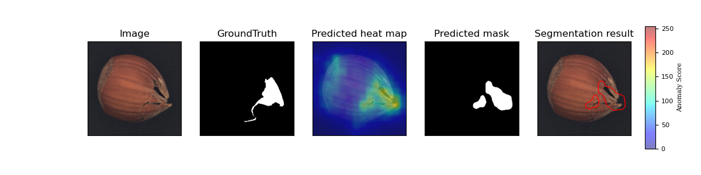
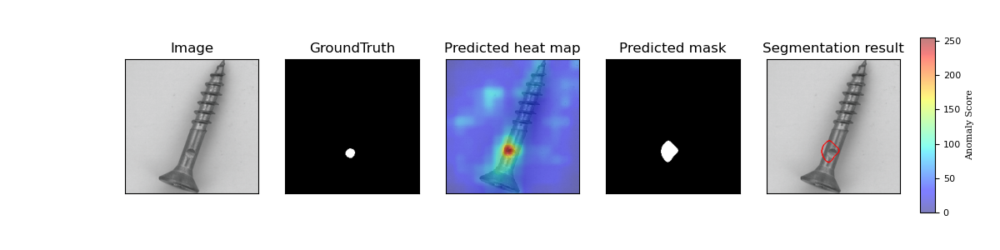
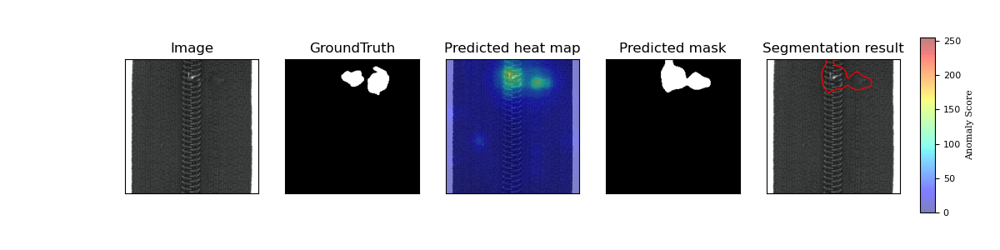

# PaDiM-EfficientNet_NS and PaDiM-EfficientNetV2

EfficentNet_NS outperforms both R18-Rd100 and WR50-Rd550 from original implementation on image-level ROCAUC significantly!!!
## Features
* The current SOTA from EfficentNet family, EfficentNet_NS(Noisy Student) and EfficientNetV2, are used as the feature extractor
* The conv_inv instead of conv is saved to speed up the calculation of mahalanobis distance


## Requirement

* Packages
  * python == 3.8.5
  * pytorch == 1.12 (lower version might work but not verified)
  * tqdm
  * sklearn
  * matplotlib
  * timm
* EfficientNet_NS model is imported from pytorch-image-models and PaDiM-EfficientNetV2 model is imported from torchvision.models

## Datasets

MVTec AD datasets : Download from [MVTec website](https://www.mvtec.com/company/research/datasets/mvtec-ad/)

## Usage

```bash
python main.py --data_path mvtec_anomaly_detection/ --save_path ./mvtec_result --arch efficientnet_b7_ns --use_gpu
```

## Results

### Implementation results on MVTec

* Image-level anomaly detection accuracy (ROCAUC)

|        MvTec        | R18-Rd100 |  WR50-Rd550  |   Effi-B7-NS   |    EffiV2-M    |
| :-----------------: | :-------: | :-----------: | :-------------: | :-------------: |
|       Carpet       |   0.984   |     0.999     |  **1.0**  |  **1.0**  |
|        Grid        |   0.898   |     0.957     | **0.997** |      0.964      |
|       Leather       |   0.988   | **1.0** |  **1.0**  |  **1.0**  |
|        Tile        |   0.959   |     0.974     | **0.991** |      0.981      |
|        Wood        |   0.990   |     0.988     | **0.995** |      0.991      |
| All texture classes |   0.964   |     0.984     | **0.997** |      0.987      |
|       Bottle       |   0.996   |     0.998     |  **1.0**  |  **1.0**  |
|        Cable        |   0.855   |     0.922     | **0.961** |      0.951      |
|       Capsule       |   0.870   |     0.915     |      0.913      | **0.916** |
|      Hazelnut      |   0.841   |     0.933     | **0.960** |      0.775      |
|      Metal nut      |   0.974   |     0.992     |      0.988      | **0.994** |
|        Pill        |   0.869   |     0.944     |      0.974      | **0.984** |
|        Screw        |   0.745   |     0.844     | **0.956** |      0.813      |
|     Toothbrush     |   0.947   |     0.972     | **0.981** |      0.931      |
|     Transistor     |   0.925   |     0.978     | **0.999** |      0.994      |
|       Zipper       |   0.741   |     0.909     | **0.946** |      0.942      |
| All object classes |   0.876   |     0.941     | **0.968** |      0.93      |
|     All classes     |   0.905   |     0.955     | **0.977** |      0.949      |

* Pixel-level anomaly detection accuracy (ROCAUC)

|        MvTec        |    R18-Rd100    |   WR50-Rd550   |   Effi-B7-NS   |    EffiV2-M    |
| :-----------------: | :-------------: | :-------------: | :-------------: | :-------------: |
|       Carpet       |      0.988      | **0.990** |      0.984      |      0.987      |
|        Grid        |      0.936      |      0.965      |      0.967      | **0.981** |
|       Leather       |      0.990      |      0.989      |      0.986      | **0.991** |
|        Tile        |      0.917      | **0.939** |      0.923      |      0.936      |
|        Wood        |      0.940      |      0.941      |      0.928      | **0.944** |
| All texture classes |      0.953      |      0.965      |      0.958      | **0.968** |
|       Bottle       |      0.981      |      0.982      |      0.971      | **0.984** |
|        Cable        |      0.949      |      0.968      | **0.973** |      0.970      |
|       Capsule       |      0.982      | **0.986** |      0.979      |      0.983      |
|      Hazelnut      | **0.979** | **0.979** |      0.977      |      0.963      |
|      Metal nut      |      0.967      | **0.971** |      0.954      |      0.959      |
|        Pill        |      0.946      | **0.961** |      0.944      |      0.959      |
|        Screw        |      0.972      |      0.983      | **0.989** |      0.982      |
|     Toothbrush     |      0.986      | **0.987** |      0.979      |      0.986      |
|     Transistor     |      0.968      |      0.975      | **0.981** |      0.960      |
|       Zipper       |      0.976      | **0.984** |      0.968      |      0.982      |
| All object classes |      0.971      | **0.978** |      0.972      |      0.973      |
|     All classes     |      0.965      | **0.973** |      0.967      |      0.971      |

### ROC Curve

* ResNet18


* Wide_ResNet50_2


* Efficientnet-b7_ns



* Efficientnet-b7_md



### Typical Localization examples

<p align="center">
    
</p>
<p align="center">
    
</p>
<p align="center">
    
</p>
<p align="center">
    
</p>
<p align="center">
    
</p>

## Reference

[1] Thomas Defard, Aleksandr Setkov, Angelique Loesch, Romaric Audigier. *PaDiM: a Patch Distribution Modeling Framework for Anomaly Detection and Localization*. https://arxiv.org/pdf/2011.08785

[2] Base code. https://github.com/xiahaifeng1995/PaDiM-Anomaly-Detection-Localization-master

[3] The distance of Mahalanobis is replaced by a tensor (attach GPU) base to reduce the inference time. https://github.com/ingbeeedd/PaDiM-EfficientNet
